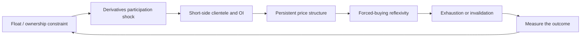

# crypto_market_structure_scanner

[](https://github.com/gobrienHFT/crypto_market_structure_scanner/actions/workflows/tests.yml)

A full-market Binance USD-M crypto perpetual dashboard and reproducible market-structure research toolkit. It combines breakout timing, account positioning, volume, open interest, funding, and BTC correlations, with a separate reflexivity research view. It is an engineering and research project, not a demonstrated profitable trading system.

**Start here:** install the [local dependencies](#local-setup), run `run_dashboard.bat` to open the dashboard in Chrome, or run the [deterministic demo](#deterministic-demo) without credentials. The dashboard uses public market data; it does not start the separate execution bots.

## Market workspace

| View | What you can inspect |
| --- | --- |
| All Markets | Every eligible Binance USD-M crypto perpetual, including majors, with sortable metrics and visible partial-data status |
| Reflexivity | Multi-factor candidate ranking, short-account changes, funding, and explicitly sourced ownership evidence |
| Breakouts | 5/20/90/180-day highs and lows, sortable crossing ages, and a daily close/MA200 chart |
| Volume & OI | Hourly volume changes, 24-hour versus prior-30-day volume, and OI value/unit comparisons |
| Correlations | BTC daily-return correlation with the actual matched observation count |
| Market Breadth | Share of eligible assets breaking out or above MA200; not a market-cap index |

Scans run in bounded background workers and retain results locally. Missing endpoints do not silently remove pairs. Crossing times identify a candle, not an exact trade: minute refinement is used where available, otherwise hourly resolution is disclosed. See [metric definitions, coverage, and architecture](docs/market-workspace.md).

### Reviewer route

1. Run the offline demo and inspect its manifest and synthetic replay. No keys or live orders are needed.
2. Run `python -m pytest -q` and inspect `tests/test_market_workspace.py` for missing-data, history-gap, timing, and UI coverage.
3. Open the dashboard, scan the universe, and compare Breakouts with Volume & OI and Reflexivity. Check the coverage and freshness indicators before interpreting a rank.
4. Read the data/UI separation in `market_dashboard_data.py` and `market_dashboard_ui.py`, then the research contracts in `crypto_market_structure/`.

The interview evidence is reproducible calculations, explicit uncertainty, failure handling, and a usable operator workflow. The remaining research question is whether these signals produce an out-of-sample edge after fees, funding, slippage, and realistic execution. The legacy `app.py` remains large; the new workspace isolates data collection and presentation without rewriting unrelated execution tools.

There is a pattern I keep coming back to in small crypto perpetual markets: headline circulation can look plentiful while the effective float is tight; derivatives activity can suddenly expand; price can keep grinding higher; and the number of accounts shorting the move can increase rather than fall. If that short cohort later has to buy, it may become part of the demand that carries the move. This repository turns that observation into something testable.

`FLOAT / OWNERSHIP -> DERIVATIVES PARTICIPATION SHOCK -> SHORT-SIDE CLIENTELE / OI -> PRICE PERSISTENCE -> FORCED-BUYING REFLEXIVITY -> EXHAUSTION / INVALIDATION`

I am testing whether that sequence contains information beyond ordinary momentum, volume, liquidity, and market-regime effects. The dashboard, Discord bot, and live monitors are useful ways to inspect the work, but the question comes first.

## Research question

Can constrained effective float, concentrated economic ownership, unusual derivatives participation, persistent upward price structure, and crowded short-side account breadth identify a regime in which buying pressure becomes self-reinforcing before the move is obvious from price alone?

I am not trying to rank every token or explain every large move. A useful result would need to survive missing-data controls, alternative explanations, realistic costs, and chronological out-of-sample testing. A convincing chart or a large historical winner is not enough.

## Mechanism



Here is the idea in plain language:

1. **Float / ownership:** headline circulating supply is not necessarily the supply that is independently available to trade. Wallets held by exchanges, custodians, bridges, LPs, protocols, system accounts, treasuries, or vesting contracts need to be identified before concentration means much.
2. **Derivatives participation:** a sudden change in OI, volume, trade activity, or cross-venue participation can make marginal demand matter more in a thin market. An isolated venue print is less useful than activity that fits the wider market picture.
3. **Short-side clientele:** a global long/short account ratio is a breadth measure. It counts accounts, not the dollars they have at risk. A high short-account share could be many small shorts, a few large shorts, or a mixture of both.
4. **Price persistence:** continuation would look like price holding or extending a breakout while OI, volume, funding, and short-account observations remain consistent with an active market. One impulse candle is not enough.
5. **Forced buying:** if price keeps moving against a crowded short cohort, discretionary covering and liquidations may add demand. That is the mechanism I want to test, not a conclusion that follows from a high ratio.
6. **Exhaustion / invalidation:** short-account rollover, falling OI, volume deceleration, rejection, or a structural breakdown may say that the fuel is being used up. The same setup that can travel far can also become fragile very quickly.

## What I can observe

The hard part is keeping each observation in its lane. A transfer is not intent, an account ratio is not notional, and a holder table is not automatically a map of economic control.

| Evidence | What it measures | What it cannot establish |
| --- | --- | --- |
| Supply and ownership | Circulating supply, FDV, estimated effective float, raw and adjusted holder concentration | That a wallet is an insider or that concentration proves manipulation |
| Wallet classifications | Exchange, custody, bridge, LP, protocol, system, treasury, vesting, and other documented categories | That an unlabelled wallet has a known intent |
| Derivatives | OI, volume, funding, venue participation, global and top-trader ratios | Direction, liquidation certainty, or short dollar notional from account counts |
| Short-side breadth | Global long/short account share and its changes over multiple horizons | The cohort's wealth, leverage, exposure, or liquidation price |
| Price structure | Returns, breakouts, persistence, volatility, VWAP context, rejection, and drawdown | A guarantee that continuation follows a breakout |
| CEX flow | Labelled transfers relative to float, spot volume, visible liquidity, and venue context | Whether the transfer will be sold or why it was sent |

Funding has one simple but important definition here: **positive funding means longs pay shorts; negative funding means shorts pay longs**. Funding is carry and positioning context, not a directional answer by itself. I read it alongside price, OI, volume, and account breadth.

## Observations and states

Before comparing outcomes, the package in `crypto_market_structure/` turns each row into a time-stamped observation. It keeps event time, receipt time, source, venue, units, freshness, provenance, data quality, and missing fields together. Raw versus adjusted ownership and account breadth versus notional stay separate all the way through.

The state model is intentionally plain:

| State | What it means |
| --- | --- |
| `DISCOVERY` | The evidence is partial, stale, or too thin to say much yet |
| `BUILDING` | Crowding, participation, OI, or price structure is forming |
| `ACTIVE_REFLEXIVITY` | Crowding, participation, OI, trend, and non-exhaustion observations agree |
| `ACCELERATING` | An active regime has stronger breakout and persistence evidence |
| `EXHAUSTION_RISK` | Extension, rejection, short-account rollover, OI weakness, or another late-risk signal is appearing |
| `INVALIDATED` | The defined price or fuel conditions have broken |

These states organize an investigation. They are not probabilities, expected returns, or trade instructions. A missing value stays missing, and stale data is not quietly treated as confirmation.

## Falsification and event study

I want the idea judged by what was knowable at the time, rather than by a story assembled after the move:

```text
point-in-time observations -> state -> frozen event -> forward outcomes -> baselines -> invalidation review
```

`crypto_market_structure/event_study.py` evaluates forward paths at 1h, 4h, 12h, 24h, 72h, and 168h. It records coverage, median returns, maximum favorable excursion, maximum adverse excursion, threshold hits, invalidation, short-unwind context, and fuel coverage. The review path also keeps matched non-events, unconditional-universe observations, token-history comparisons, benchmark excess, and chronological holdout views where the data supports them.

The question is incremental information: does account-count short breadth add anything after OI, funding, price, volume, liquidity, token age, top-trader positioning, market regime, and data quality are considered? Does the result survive removal of the largest winners, realistic fees and slippage, listing and delisting controls, and a final untouched period?

## RAVE and LAB

RAVE and LAB are the motivating case studies. They help define what to look for and what can go wrong, but they are not proof that the proposed mechanism caused either move or that it will recur. The supplied chart references do not reconstruct all contemporaneous holder, OI, funding, venue, liquidation, or account-level observations.

The [reflexivity casebook](docs/reflexivity-casebook.md) keeps observed facts, inferences, hypotheses, and unavailable evidence separate. The [case-study event summary](docs/case-study-event-summary.md) records local evidence and gaps. The broader [mechanism thesis](docs/mechanism-thesis.md) and [low-float hypothesis notes](docs/short-squeeze-low-float-strategy.md) explain the proposed variables and the tests I would want to run.

## Deterministic demo

The quickest way to see the method without credentials or a live exchange is:

```powershell
python -m crypto_market_structure.review_demo
```

Then:

1. Read the printed signal version, observation count, event count, and manifest path.
2. Open `artifacts/review_demo/review_report.md`.
3. Read the state replay and missing fields before looking at the outcome table.
4. Inspect `artifacts/review_demo/manifest.json` for input and artifact hashes, configuration, event-study definition, and holdout metadata.

The fixture is frozen and synthetic. It shows that the observation-to-state-to-event-study workflow can be reproduced; it does not show historical alpha, profitability, causality, or short notional hidden behind account counts.

## Live surfaces

Once the offline path is clear, the live tools provide faster ways to look at the same questions:

- **Streamlit:** `app.py` opens the six-view full-market workspace above. Ownership enrichment is on demand; evidence is not described as proof of manipulation.
- **Discord:** the bot and watcher provide triage, diagnostics, evidence cards, and outcome archives. See [Discord Alpha Workflow](docs/discord-alpha-workflow.md) for commands and venue rules.
- **Monitors and execution helpers:** these are isolated operational tools. They are not evidence for the hypothesis and should remain disabled unless deliberately configured and reconciled against the exchange.

The long command lists and BAT-file instructions live in [Demo Walkthrough](docs/demo-walkthrough.md) and [Architecture](docs/architecture.md), where they can be useful without taking over the research narrative.

## Discord command index

The bot's static command set is listed here so the repository documents its public surface. Use `/help` or `/commands` in Discord for the live parameter list and current descriptions.

```text
/alpha
/cexdiag
/cexflow
/cextargets
/coin
/coincheck
/commands
/convex
/convex_archive
/convex_scoreboard
/convex_status
/corr
/crimepump
/dossier
/earlyflow
/floattrap
/flowblocked
/flowcoin
/flowhealth
/flowproof
/flowstress
/funding
/gates
/help
/high
/hunt
/low
/precrime
/prime
/pumpwatch
/radar
/ravelab
/sethflow
/setupscore
/shorts
/shortpct
/shorttrend
/squeezeready
/startbot
/stopbot
/sync_commands
/thesis
/terminal
/timing
/tradebot_status
/whales
```

## Where the idea can fail

- Account-count ratios do not reveal short notional, leverage, wealth, or liquidation levels.
- Holder concentration is only useful after exchange, custody, bridge, LP, protocol, system-wallet, treasury, and vesting classifications are considered.
- CEX deposits can reflect inventory preparation, internal movement, market making, or distribution. Labels and intent are uncertain.
- OI and funding are not directional on their own. Positive funding can coexist with rising price and a high short-account share.
- Explorer APIs, exchange endpoints, venue labels, supply data, and historical snapshots can be stale, incomplete, or blocked. A failed request means unknown coverage.
- RAVE and LAB are examples for testing, not causal proof.
- The synthetic fixture demonstrates method and reproducibility, not performance.
- Any live decision, sizing, execution, or risk remains outside the evidence claims of this repository.

## Repository map

| Area | Purpose |
| --- | --- |
| `crypto_market_structure/` | Observations, state assessment, reporting projection, event study, casebook, manifest, and offline replay |
| `crypto_market_structure/fixtures/` | Frozen synthetic input and dated historical exports used as research context |
| `app.py` | Streamlit presentation surface |
| `discord_convex_bot.py` and related modules | Discord presentation and triage surface |
| `tests/` | Tests for the existing research and operational contracts |
| `docs/` | Mechanism notes, case studies, workflow details, and review prompts |

## Local setup

```powershell
python -m venv .venv
.\.venv\Scripts\Activate.ps1
python -m pip install --upgrade pip
python -m pip install -r requirements.txt
python scripts/security_audit.py
python -m pytest -q
```

The offline replay needs no API keys. Live exchange, explorer, Discord, and execution credentials belong in a local `.env`, which is ignored by Git. Use `.env.example` only as a blank template.

## Further reading

- [Architecture](docs/architecture.md)
- [Demo Walkthrough](docs/demo-walkthrough.md)
- [Discord Alpha Workflow](docs/discord-alpha-workflow.md)
- [Case-study backfill checklist](docs/case-study-backfill-checklist.md)
- [Core thesis gate audit](docs/core-thesis-gate-audit.md)
- [GPT-5.6 Sol review prompt](docs/gpt56-sol-review-prompt.md)
- [Security and release notes](SECURITY.md)
