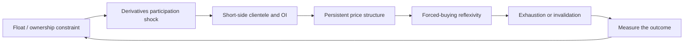

# crypto_market_structure_scanner

[](.github/workflows/tests.yml)

`crypto_market_structure_scanner` studies reflexive crypto regimes in which constrained effective float, concentrated economic ownership, abnormal derivatives participation, persistent upward price structure, and fragmented short-side positioning may create forced-buying feedback loops.

`FLOAT / OWNERSHIP -> DERIVATIVES PARTICIPATION SHOCK -> SHORT-SIDE CLIENTELE / OI -> PRICE PERSISTENCE -> FORCED-BUYING REFLEXIVITY -> EXHAUSTION / INVALIDATION`

The project is a research system for testing that sequence with point-in-time evidence. Streamlit, Discord, and live monitors are implementation surfaces around the research model; they are not the intellectual identity of the repository.

## Research question

Can a combination of constrained effective float, concentrated ownership, unusual derivatives participation, persistent price structure, and crowded short-side account breadth identify a regime in which buying pressure becomes self-reinforcing before the move is obvious from price alone?

The question is deliberately narrower than "which markets will make a large move." A positive result would need to survive missing-data controls, alternative explanations, realistic costs, and chronological out-of-sample testing. A plausible chart or a large historical winner is not enough.

## Mechanism



The working mechanism is:

1. **Float / ownership:** headline circulating supply may overstate the supply that is available to trade. Economic ownership must be separated from exchange custody, bridges, LPs, protocol or system wallets, vesting, and other non-comparable balances.
2. **Derivatives participation:** a sharp change in OI, volume, trade activity, or venue participation can make marginal demand matter more in a thin market.
3. **Short-side clientele:** global long/short account ratios measure account breadth, not short or long dollar notional. A high short-account share can describe many small accounts rather than a large aggregate short position.
4. **Price persistence:** continuation requires more than one impulse candle. Breakout persistence, volume, OI, funding, and short-account observations should agree without an exhaustion or breakdown signal.
5. **Forced buying:** if short positions are crowded and price keeps moving against them, covering or liquidation can add demand. This is a testable hypothesis, not an inference from the account ratio alone.
6. **Exhaustion / invalidation:** short-account rollover, falling OI, volume deceleration, rejection, or a breakdown can indicate that the fuel is fading. The event study measures both favorable excursion and adverse excursion rather than only the eventual high.

## What is observed

The canonical observation model keeps the evidence categories separate so that a missing or ambiguous field cannot silently become confirmation.

| Evidence | What it measures | What it does not establish |
| --- | --- | --- |
| Supply and ownership | Circulating supply, FDV, estimated effective float, raw and adjusted holder concentration | That a wallet is an insider or that concentration proves manipulation |
| Wallet classifications | Exchange, custody, bridge, LP, protocol, system, treasury, vesting, and other documented classifications | That an unlabelled wallet has a known intent |
| Derivatives | OI, volume, funding, venue participation, global and top-trader ratios | Direction, liquidation certainty, or short dollar notional from account counts |
| Short-side breadth | Global long/short account share and its changes over multiple horizons | The wealth, leverage, or exposure of those accounts |
| Price structure | Returns, breakouts, persistence, volatility, VWAP context, rejection, and drawdown | A guarantee that continuation will follow a breakout |
| CEX flow | Labelled transfers relative to float, spot volume, visible liquidity, and venue context | Whether a transfer will be sold or the intent of its sender |

Funding semantics are explicit: **positive funding means longs pay shorts; negative funding means shorts pay longs**. Funding is a carry and positioning observation, not a standalone directional explanation.

## Normalized observations and state model

The importable `crypto_market_structure/` package is the source of truth for the research definitions. It normalizes observations with event time, receipt time, source, venue, units, freshness, provenance, data quality, and missing fields. Raw and adjusted ownership, account breadth and notional, and labelled custody and inferred control remain distinct concepts.

Each observation is assessed through an explicit state machine:

| State | Interpretation |
| --- | --- |
| `DISCOVERY` | Partial, stale, or low-quality evidence that needs investigation |
| `BUILDING` | Crowding, participation, OI, or price structure is forming, but the complete regime is not present |
| `ACTIVE_REFLEXIVITY` | Crowding/build, participation, OI, trend confirmation, and non-exhaustion evidence agree |
| `ACCELERATING` | An active regime has stronger breakout and persistence evidence |
| `EXHAUSTION_RISK` | Extension, rejection, short-account rollover, OI weakness, or other late-risk evidence is increasing |
| `INVALIDATED` | The defined price or fuel conditions have broken |

The displayed component assessments are interpretability aids. They are not probabilities, expected returns, or trade instructions. Missing values remain missing; stale evidence is not treated as a positive observation.

## Falsification and event study

The research path is:

```text
point-in-time observations -> normalized state -> frozen event -> forward outcomes -> baseline comparison -> invalidation review
```

`crypto_market_structure/event_study.py` evaluates forward price paths at 1h, 4h, 12h, 24h, 72h, and 168h. It records coverage, median returns, maximum favorable excursion, maximum adverse excursion, threshold hits, invalidation, short-unwind context, and fuel coverage. The review workflow also carries matched non-event, unconditional-universe, token-history, benchmark-excess, and chronological holdout views where the data supports them.

The central test is incremental information. Does account-count short breadth add anything after controlling for OI, funding, price, volume, liquidity, token age, top-trader positioning, market regime, and data quality? Does the result survive removal of the largest winners, realistic fees and slippage, listing and delisting bias controls, and a final untouched period?

## Case studies

RAVE and LAB are historical case studies used to define questions and failure modes, not proof of causality or repeatable alpha. The supplied chart references do not reconstruct all contemporaneous holder, OI, funding, venue, liquidation, or account-level observations. The casebook keeps observed facts, inferences, hypotheses, and unavailable evidence separate.

- [Reflexivity casebook](docs/reflexivity-casebook.md): RAVE and LAB phase records.
- [Case-study event summary](docs/case-study-event-summary.md): local evidence, gaps, and follow-up actions.
- [Mechanism thesis](docs/mechanism-thesis.md): broader mechanism taxonomy and external references.
- [Low-float strategy notes](docs/short-squeeze-low-float-strategy.md): the working hypothesis, signal definitions, risks, and tests.

## Deterministic demo

Run the complete credential-free replay from the repository root:

```powershell
python -m crypto_market_structure.review_demo
```

In roughly one minute:

1. Read the printed signal version, observation count, event count, and manifest path.
2. Open `artifacts/review_demo/review_report.md`.
3. Check the state replay and missing fields before reading the outcome table.
4. Inspect `artifacts/review_demo/manifest.json` for input and artifact hashes, configuration, event-study definition, and holdout metadata.

The fixture is frozen and synthetic. It proves that the observation-to-state-to-event-study workflow is reproducible; it does not prove historical alpha, profitability, causality, or that account-count shorting equals short notional.

## Live research surfaces

The live surfaces project the research model into faster workflows:

- **Streamlit:** `app.py` presents the focused Convex Squeeze Radar, lifecycle views, evidence status, and on-demand structural proof. Market telemetry is kept separate from heavier holder or explorer refreshes.
- **Discord:** the bot and watcher provide live triage, evidence cards, diagnostics, and outcome archives. The command details and venue-gating rules are in [Discord Alpha Workflow](docs/discord-alpha-workflow.md).
- **Execution and monitors:** auto-trader and short-ROC close utilities are isolated operational tools, disabled unless explicitly configured, and should be treated as operational risk rather than research evidence.

For setup and operational examples, see [Demo Walkthrough](docs/demo-walkthrough.md) and [Architecture](docs/architecture.md). The long Discord command and BAT-file documentation stays there instead of competing with the research narrative.

## Limitations

- Account-count ratios are breadth measures, not exposure measures. They cannot identify the actual short notional, leverage, wealth, or liquidation level of the cohort.
- Holder concentration is only meaningful after exchange, custody, bridge, LP, protocol, system-wallet, treasury, and vesting classifications are considered.
- CEX deposits can represent inventory preparation, internal movement, market making, or distribution. Wallet labels and intent are uncertain.
- OI and funding are not directionally self-explanatory. Positive funding can coexist with a rising price and crowded short accounts; the sign must be interpreted with the rest of the state.
- Explorer APIs, exchange endpoints, venue labels, supply data, and historical snapshots can be stale, incomplete, or blocked. A failed request means unknown coverage, not no activity.
- RAVE and LAB are anchors for falsifiable tests. They are not evidence that the same mechanism caused either move or that it will recur.
- The deterministic fixture is synthetic. Its attractive paths are method demonstrations, not a performance record.
- No result should be treated as personalized financial advice or a guarantee of execution, continuation, or profit.

## Repository map

| Area | Purpose |
| --- | --- |
| `crypto_market_structure/` | Canonical observations, state machine, reporting projection, event study, casebook, manifest, and offline replay |
| `crypto_market_structure/fixtures/` | Frozen synthetic input and dated historical exports used as research context |
| `app.py` | Streamlit presentation surface |
| `discord_convex_bot.py` and related modules | Discord presentation and triage surface |
| `tests/` | Tests for the existing research, presentation, and operational contracts |
| `docs/` | Architecture, mechanism notes, case studies, workflow details, and review prompts |

## Local setup

```powershell
python -m venv .venv
.\.venv\Scripts\Activate.ps1
python -m pip install --upgrade pip
python -m pip install -r requirements.txt
python scripts/security_audit.py
python -m pytest -q
```

The offline replay needs no API keys. Live exchange, explorer, Discord, and execution credentials belong in a local `.env`, which is ignored by Git. Use `.env.example` only as a blank template.

## Further reading

- [Architecture](docs/architecture.md)
- [Demo Walkthrough](docs/demo-walkthrough.md)
- [Discord Alpha Workflow](docs/discord-alpha-workflow.md)
- [Case-study backfill checklist](docs/case-study-backfill-checklist.md)
- [Core thesis gate audit](docs/core-thesis-gate-audit.md)
- [GPT-5.6 Sol review prompt](docs/gpt56-sol-review-prompt.md)
- [Security and release notes](SECURITY.md)

The system is research infrastructure. Any live decision, sizing, execution, or risk remains outside the scope of this repository's evidence claims.
