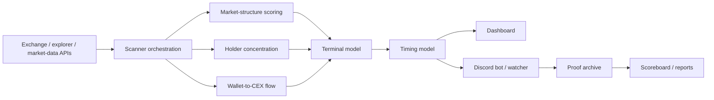

# Architecture

The project is organized as a research pipeline with three user-facing surfaces:

- Streamlit dashboard for interactive investigation
- Discord bot and watcher for live triage
- proof archive for outcome measurement

## Data Flow

## Core Modules

| Area | Modules | Purpose |
| --- | --- | --- |
| Scanner orchestration | `scan_orchestrator.py`, `app.py` | Runs fresh scans, normalizes scan metadata, writes Discord cache |
| Exchange data | `binance_futures.py`, `external_markets.py`, `cmc_movers.py` | Binance futures, external venue mix, CMC movers |
| Holder concentration | `concentration_scanner/`, `holder_composition.py` | Contract discovery, holder classification, concentration metrics |
| CEX flow | `cex_flow_scanner.py` | Concentration-gated wallet-to-exchange transfer monitoring |
| Scoring | `market_structure_scoring.py`, `convexity_scoring.py`, `short_squeeze_scoring.py`, `terminal_engine.py`, `timing_engine.py`, `archetype_scoring.py`, `early_pump_radar.py` | Structural scoring, squeeze fuel, terminal edge, timing quality, case-study analogue matching, single-board early pump ranking |
| Discord | `discord_convex_bot.py`, `discord_convex_watcher.py`, `discord_flag_formatter.py` | Slash commands, webhook watcher, alert cards |
| Validation | `proof_engine.py`, `tests/` | Archive alerts, refresh outcomes, test scoring and bot contracts |

`market_structure_scoring.py` is the neutral public import for lifecycle scoring. `crime_scoring.py` remains as a compatibility wrapper for older scripts, notebooks, and cached workflows.

## Live Discord Path

1. `discord_convex_bot.py` or `discord_convex_watcher.py` asks `scan_orchestrator.py` for a fresh scan.
2. `scan_orchestrator.py` imports `app.py` in `CRYPTO_SCANNER_IMPORT_ONLY=1` mode and calls the undecorated scan function.
3. The result is enriched by terminal and timing models.
4. CEX-flow enrichment converts token transfers into venue-inventory stress by comparing deposit notional with visible ask depth and 24h turnover.
5. Archetype scoring compares rows with RAVE-style cap-table reflexivity, LAB-style venue-inventory stress, SIREN-style short-fuse compression, RIVER-style runway breakouts, and STO-style target-venue squeeze structures.
6. `early_pump_radar.py` collapses target-CEX flow, whale/control, low float, short crowding, venue support, archetype match, timing, and not-late risk into one ranked pump-watch layer.
7. Venue gating keeps Discord focused on Binance perp plus Bitget trading evidence; Gate and labelled CEX transfer targets are supporting evidence, not Bitget substitutes, unless a command is explicitly run in diagnostic ungated mode.
8. `discord_flag_formatter.py` renders a research card with thesis, evidence stack, trigger, next check, invalidation, liquidity warning, and case-study analogue when available.
9. `proof_engine.py` archives alerts, including structure-edge, inventory-stress, and archetype scores, then later refreshes outcome metrics.

## Design Constraints

- The scanner is a research system, not an execution engine.
- Alerts use neutral structural language and avoid assertions about intent.
- Large scans should degrade gracefully through local caches.
- Discord outputs must fit embed limits and remain readable under pressure.
- Outcome tracking is part of the product, not an afterthought.
